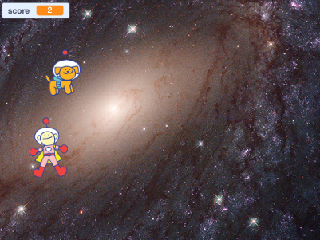

## Introduction

Create a Scratch game to simulate the effects of weightlessness in space. 

You will:

- Simulate weightlessness using a `forever`{:class="block3control"} loop and `point in direction`{:class="block3motion"} blocks
- Add and edit a 'Game Over' backdrop then `switch backdrop`{:class="block3looks"} using code
- Use the Scratch `timer`{:class="block3sensing"} variable and make your own `score variable`{:class="block3variables"} to create a game

--- no-print ---
--- task ---
### Try it

Click on the green flag in the top left corner to start the game. Use the arrow keys to move around.

How many times can you catch the space dog in 30 seconds?

  <iframe allowtransparency="true" width="485" height="402" src="https://scratch.mit.edu/projects/embed/501663888/?autostart=false" frameborder="0"></iframe>

--- /task ---
--- /no-print ---

--- print-only ---

--- /print-only ---

**Tim Peake** was the first British ESA astronaut to visit the International Space Station. You can find out more about his mission, the forces of gravity, and the effects of weightlessness on [The National STEM Centre website](http://www.nationalstemcentre.org.uk/timpeake){:target="_blank"}.

