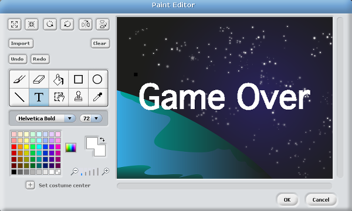
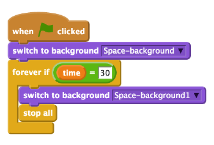
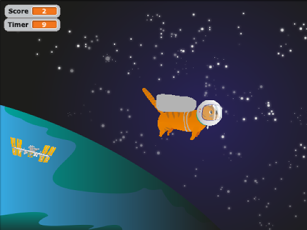

## Creating a Game Over screen

First, you need to add a new Game Over background to the stage. You could paint or import a new one, but here we will duplicate the existing space background and edit it to display Game Over across it in large letters.

- Click on the **stage** icon and then click on **backgrounds**. Make a copy of the space background by clicking on **copy**.

- Now click on **Edit** to open the paint editor window. Using the text tool, type 'Game Over' in large letters on the background. You can choose a colour and font that you like. When you're happy with how it looks, click on **OK**.

	

- Next, click on the **Scripts** tab and add a `when green flag clicked` control block to the scripts area. Note that the scripts area on the stage should be empty, as all your other scripts are on your sprites.

- Add a `switch to background` look block underneath. Select **space background** from the drop-down box. This is the stage that you want the game to start with.

- Now add a `forever if` block to the script. Place an `equals` operator block inside the hexagon section of the `forever if` block. Click on the variables blocks, drag the `time` variable block across and add it to the left-hand side of `=`. Type `30` into the right-hand side of `=`.

- Then place a `switch to background` block inside the `forever if` block. Select **space background1** from the drop-down list. This should be your Game Over screen.

- Finally, add a `stop all` control block underneath the last block. The `stop all` control block will stop all the scripts in Scratch from running, ending the game.

	

- Save your game and test that it works by clicking on the green start flag.

	

