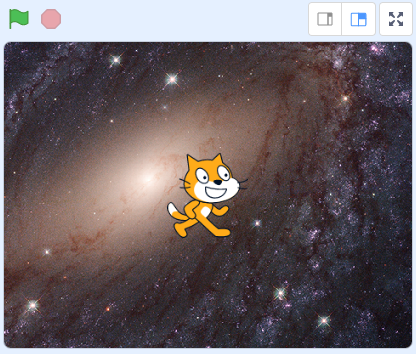
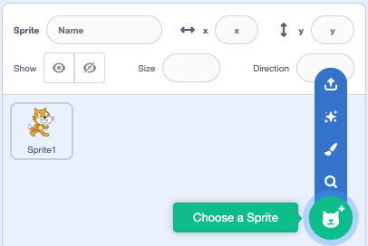
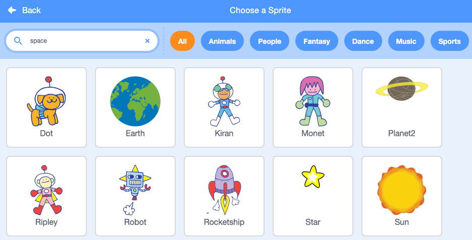
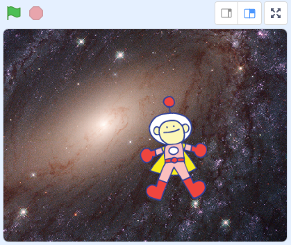
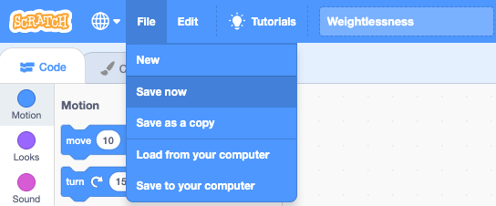

## Set the space scene

On Earth, **gravity** pulls everything and everybody down towards the ground. In space it feels like everything is floating because it is no longer being pulled by our planet’s gravity.

You will set up your weightlessness space game with a space backdrop and a space character. 

--- task ---

Open a [new Scratch project](http://rpf.io/scratch-new){:target="_blank"}. Scratch will open in another browser tab.

--- collapse ---
---
title: Working offline
---
To set up Scratch for offline use, visit [our Scratch guide](https://projects.raspberrypi.org/en/projects/getting-started-scratch/1){:target="_blank"}.
--- /collapse ---
--- /task ---

A backdrop sets the scene by changing the way the Stage looks.

--- task ---

Click on **Choose a Backdrop** from the Stage pane:

--- /task ---

--- task ---

Select the **Space** category and choose the backdrop you like best:

--- /task ---

--- task ---

Your Stage should now look something like this:

--- /task ---

Sprites are characters and objects in Scratch. Can you find a sprite that has already been included in your project? That’s Scratch the cat, but we need a sprite with an astronaut suit. 

--- task ---

Delete the **Sprite1** cat sprite by clicking the trash can in the Sprite list:

--- /task ---

--- task ---

Click on **Choose a Sprite** from the Sprite list:

--- /task ---

--- task ---

Click in the search box and type `space` then select your favourite character. We've chosen the **Ripley** sprite: 

--- /task ---

--- task ---

Your stage should look something like this: 

--- /task ---

--- task --- 

## Save your project

Type `Weightlessness` into the project title box at the top of the screen: 

**Tip:** Give your projects helpful names so that you can easily find them when you have lots of projects.

Next, click on **File**, and then on **Save now** to save your project:

If you are not online or you do not have a Scratch account, you can click on **Save to your computer** to save a copy of your project.

--- /task ---

It takes astronauts on board **The International Space Station** some time to get used to the feeling of weightlessness. These [Weightlessness videos](https://www.stem.org.uk/elibrary/resource/29076){:target="_blank"} from NASA show how people and objects behave in space.

