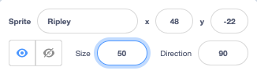
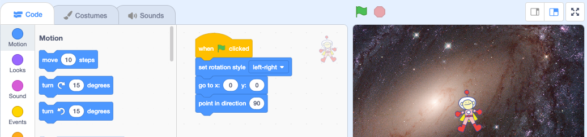

## Add weightlessness

Your character is in space and will be floating around experiencing the effects of weightlessness. 

At the moment, your character sprite is quite big so your game will be too easy!

--- task ---

From the Sprite pane click in the **Size** property and change the value to `50`%:



--- /task ---

A group of connected blocks in Scratch is called a script. You will add a script to your character sprite to start in the middle of the Stage then move `forever`{:class="block3control"} through space. 

--- task ---

Click on the `Events`{:class="block3events"} Blocks menu and drag a `when flag clicked`{:class="block3events"} block to the Code area. Connect some `Motion`{:class="block3motion"} blocks to the bottom of your script to get your character sprite ready to move:


```blocks3
when green flag clicked
set rotation style [left-right v]
go to x: (0) y: (0)  // the middle fo the screen
point in direction (90) // facing the right
```



**Test:** Click on the `green flag`{:class="block3events"}, your character sprite will move to the middle of the Stage.

--- /task ---

--- task ---

Add a `forever`{:class="block3control"} loop to the bottom of your script. Insert `Motion`{:class="block3motion"} blocks inside your `forever`{:class="block3control"} loop to create weightless movement:


```blocks3
when green flag clicked
set rotation style [left-right v]
go to x: (0) y: (0)  // the middle fo the screen
point in direction (90) // facing the right
+ forever
move (2) steps
if on edge, bounce // turn around at edge of Stage
```

**Test:** Click on the `green flag`{:class="block3events"} again, your character sprite will float across the Stage.

--- /task ---

--- save ---