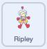

## Control direction

Astronauts can control the direction of their movements. 

To make this project suitable for mobile devices, you will use the location of the cursor when the left mouse button is pressed, or when a finger touches the screen, to control the movement of your character. Luckily, Scratch’s `mouse down`{:class="block3sensing"} block works for fingers on mouse buttons and on touchscreens!

--- task ---

Your program needs to continuously detect when the left mouse button is pressed. To do this, start a new script with a `when flag clicked`{:class="block3events"} block then add a `forever`{:class="block3control"} loop to your script. Inside the `forever`{:class="block3control"} loop add an `if ... then`{:class="block3control"} block to detect if `mouse down`{:class="block3sensing"}:



```blocks3
when flag clicked
forever
if <mouse down?> then
```

--- /task ---

--- task ---

If the user clicks the cursor closer to the left-hand side of the Stage than your character's position, then your character sprite moves to the left.

This action is possible because the position of the cursor along the x axis is stored in the `mouse x`{:class="block3sensing"} block.

To get the program to respond to where the user clicks, add the following blocks: `if`{:class="block3control"} `mouse x`{:class="block3sensing"} is `less than`{:class="block3operators"} the `x position`{:class="block3motion"} of your character sprite, `then`{:class="block3control"} the sprite should face to the left and `change x by`{:class="block3motion"} `-10` to move to the left:


```blocks3
when flag clicked
forever
if <mouse down?> then
+if <(mouse x) < (x position)> then
point in direction (-90) //Direction -90 points to the left
change x by (-10)
end
end
end
```

--- /task ---

--- task ---

**Test:** Click on the green flag to run the program to test that your character faces and moves to the left when you click to the left of your character.

--- /task ---

--- task ---

When the mouse is clicked, `if`{:class="block3control"} `mouse x`{:class="block3sensing"} is `greater than`{:class="block3operators"} the `x position`{:class="block3motion"}, `then`{:class="block3control"} your character sprite should face to the right and `change x by`{:class="block3motion"} `10` to move to the right. Add the following blocks:


```blocks3
when flag clicked
forever
if <mouse down?> then
if <(mouse x) < (x position)> then
point in direction (-90) //Direction -90 points to the left
change x by (-10)
end
+if <(mouse x) > (x position)> then
point in direction (90) //Direction 90 points to the right
change x by (10)
end
end
end
```

--- /task ---

--- task ---

**Test:** Click on the green flag to run the program to test that your character faces and moves to the right when you click to the right of your character.

--- /task ---

If the user clicks the cursor closer to the top of the Stage than your character's position, then your character sprite moves up.

This action is possible because the position of the cursor along the y axis is stored in the `mouse y`{:class="block3sensing"} block.

--- task ---

Add code to face and move up if `mouse y`{:class="block3sensing"} is `greater than`{:class="block3operators"} the `y position`{:class="block3motion"}. Also face and move down `if`{:class="block3control"} `mouse y`{:class="block3sensing"} is `less than`{:class="block3operators"} the `y position`{:class="block3motion"}:


```blocks3
when flag clicked
forever
if <mouse down?> then
if <(mouse x) < (x position)> then
point in direction (-90) //Direction -90 points to the left
change x by (-10)
end
if <(mouse x) > (x position)> then
point in direction (90) //Direction 90 points to the right
change x by (10)
end
+if <(mouse y) > (y position)> then
point in direction (0) //Direction 0 points up
change y by (-10)
end
+if <(mouse y) < (y position)> then
point in direction (180) //Direction 180 points down
change y by (10)
end
end
end
```
--- /task ---

--- test ---

**Test:** Click on the `green flag`{:class="block3events"} to run your project. You can now move your character sprite in all directions.

--- /task ---

--- save ---
