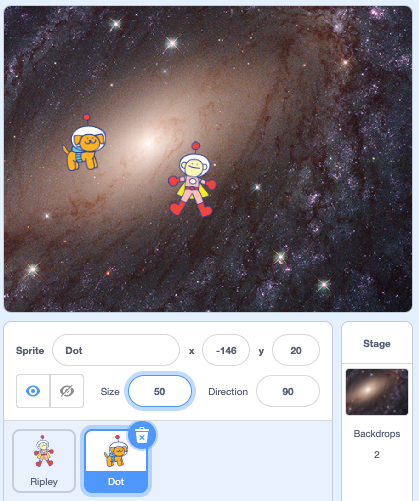
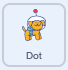

## Catch a sprite

Your character needs something to chase.It could be another character or an object.What will you choose? We're used the **Dot** spacedog sprite but you can use whatever you like. 

--- task ---

Click on the **Choose a sprite** button to see the available sprites. Find one you like and click on it to add it to your project:


**Tip:** You'll need to change the size again so it suits your game:



--- /task ---

Add code to make your sprite appear in different places each time the `green flag`{:class="block3events"} is clicked.

--- task ---

Drag a `when flag clicked`{:class="block3events"} block to your new sprite. Use `hide`{:class="block3looks"}, `go to random position`{:class="block3motion"}, `wait`{:class="block3control"} and `show`{:class="block3looks"} blocks so your new sprite appears in a surprise position:



```blocks3
when flag clicked
hide // disapears from the stage
wait (1) seconds // builds suspense
go to [random position v] // moves to new position
show // appears on the stage
```

**Test:** Run your project a couple of times. Does your new sprite move to a different position each time?

--- /task ---

To turn your project into a game the script needs to repeat every time your characters touch.

--- task ---

Add a `forever`{:class="block3control"} loop to the bottom of your script and insert an `if`{:class="block3control"} condition block inside. 

To sense `if`{:class="block3control"} your sprites are touching, add a `touching mouse-pointer ?`{:class="block3sensing"} block and select your sprite name from the dropdown:


```blocks3
when flag clicked
hide // disapears from the stage
wait (1) seconds // builds suspense
go to [random position v] // moves to new position
show // appears on the stage
+forever
if <touching [Ripley v]> then // update to show your first sprite
```

--- /task ---

--- task ---

Inside the `if`{:class="block3control"} block add the same four blacks you used earlier:


```blocks3
when flag clicked
hide // disapears from the stage
wait (1) seconds // builds suspense
go to [random position v] // moves to new position
show // appears on the stage
forever
if <touching [Ripley v]> then
+ hide
+ wait (1) seconds 
+ go to [random position v] 
+ show 
```

**Test:** Run your project. Use the arrow keys to move your character. When your sprites touch your new sprite will hide and appear in a new position. 

--- /task ---

--- save ---