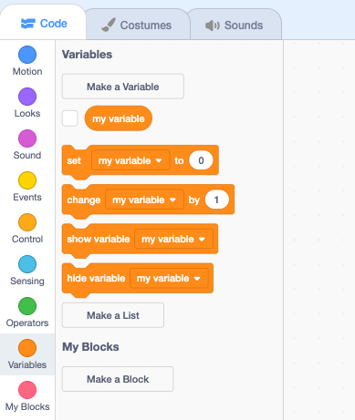
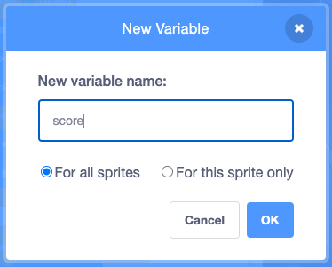
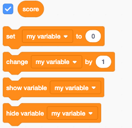
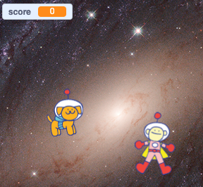
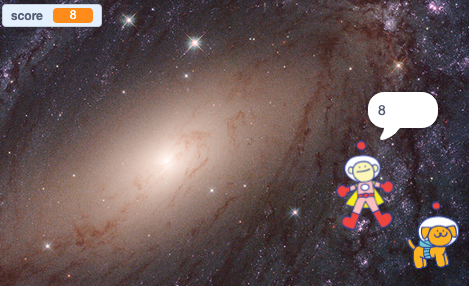

## Make a game of it with variables 

Games often have features to show players how well they did against other players or themselves. Can you think of a game that shows you how well you did? 

In your weightlessness game you'll use the built-in Scratch `timer`{:class="block3sensing"} variable and create a `score`{:class="block3variables"} variable to show how many objects the character caught in 30 seconds. 

First, create a `score`{:class="block3variables"} variable. 

--- task ---

Go to the `Variables`{:class="block3variables"} Blocks menu and click on the **Make a variable** button:



Type 'score' as your **New variable name** and select **For all sprites**:



--- /task ---

--- task ---

The `score`{:class="block3variables"} variable appears in the `Variables`{:class="block3variables"} Blocks menu. It has a tick next to it which means it appears on the Stage. 

Try unticking the box to see what happens, you can choose whether or not you want to display your `score`{:class="block3variables"} on Stage during the game. 





--- /task ---

The `score`{:class="block3variables"} variable will start at '0' `when  flag clicked`{:class="block3events"} and store the number of times your sprites `touch`{:class="block3sensing"}. 

--- task ---

Click on your character sprite and a new script to reset the score:


```blocks3
when flag clicked 
set [score v] to (0)
```

--- /task ---

--- task ---

Click on your object sprite and find the `if`{:class="block3control"} `touching`{:class="block3sensing"} script. Insert a block to `change score by 1`{:class="block3variables"}:


```blocks3
when flag clicked
hide // disapears from the stage
wait (1) seconds // builds suspense
go to [random position v] // moves to new position
show // appears on the stage
forever
if <touching [Ripley v]> then
+ change [score v] by (1) 
hide
wait (1) seconds 
go to [random position v] 
show 
```

**Test:** Run your project. Your score will update each time the sprites touch. Run your project again to test that the `score`{:class="block3variables"} goes back to zero when you start a new run.

--- /task ---

Now that you have a `variable`{:class="block3variables"} to store the score you can use this in other ways. Your character sprite can `say`{:class="block3looks"} the `score`{:class="block3variables"} at the end of the game.

--- task ---

Click on your character sprite. Add a new script to end the game `when timer is greater than 30`{:class="block3events"}.

**Tip:** To find the `when timer >`{:class="block3events"} block use the `when loudness >`{:class="block3events"} block from the `Events`{:class="block3events"} Blocks menu and change the drop down to `timer`{:class="block3events"}.


```blocks3
when [timer v] > (30) // 30 second after flag clicked
say (score)
stop [other scripts in sprite v] 
```



--- /task ---

--- save ---