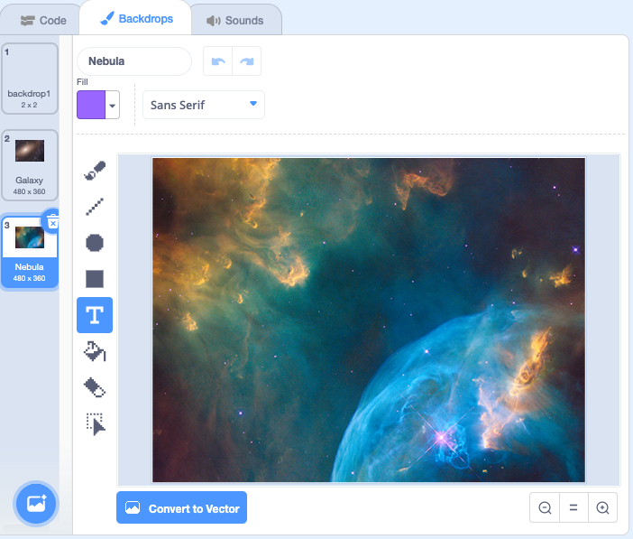
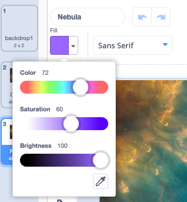
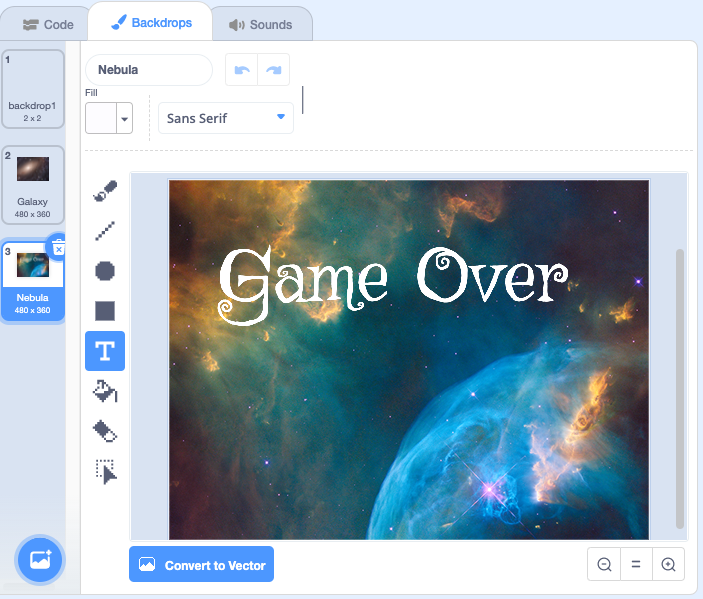

## Create a Game Over screen

Game over screens are a great way to end video gomes. Some have a simple 'game over' message whilst others have details of who made the game, and some may even feature all the sprites involved in a game. 

To create a game over screen you'll need to add a backdrop and edit it with colours, shapes, or text.

--- task ---

Click on the **Choose a Backdrop** button. If you want to continue your space theme, click on the **Space** category. We chose **Nebula**, but you can choose any backdrop you like:


--- /task ---

--- task ---

Click on the **Backdrops** tab and you will see the backdrops currently in your project with your new backdrop at the bottom of the list. 



--- /task ---

Edit your backdrop to include some text. 

--- task ---

Click on the **Text** tool:


Choose the colour and font style you want from the drop-down boxes: 



**Tip:** Use the sliders in the **Fill** colour chooser to pick your colour. If the colours turn only to black or white, you might need to adjust the **Saturation** or **Brightness** sliders.

--- /task ---

--- task ---

Click where you want the text to appear on the backdrop, then type `Game Over` or words of your choice.



--- /task ---

Set up your game to start on your first backdrop, then change to the Game Over backdrop at the end.

--- task ---

Click on your character sprite, at the end of your `set score to 0`{:class="block3variables"} script, add a `switch backdrop`{:class="block3looks"} block:


```blocks3
when flag clicked 
set [score v] to (0)
+ switch backdrop to [Galaxy v] //Switch to your main backdrop
```

--- /task ---

--- task ---

Find your `when timer > 30`{:class="block3events"} script and insert a `switch backdrop`{:class="block3looks"} block at the top.


```blocks3
when [timer v] > (30) //30 seconds after flag clicked
+ switch backdrop to [Nebula v] //Switch to your Game Over backdrop
say (score)
stop [other scripts in sprite v] 
```

**Test:** Run your project. Does your backdrop change to the Game Over screen? When you run it for a second time, does it switch back at the start of the game?

--- /task ---

--- save ---
