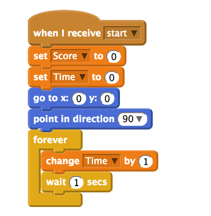

## Make a game of it with variables

A way to keep score during the game is required. You can use a variable in your code to do this. A variable is a fancy name for storing data for use later on.

- To create a variable, click on `Variables` in the blocks palette and then click `Make a Variable`. The `New Variable` window opens and asks you to type a name for your variable.

- Name the first variable `score` and ensure that `For all sprites` is checked before clicking **OK**.

- You’ll see some orange blocks are added to your Variable area called `score`, and a small counter box will appear on the stage.

- Create another variable called `Time` that you can use to time each game.

- Navigate back to your first script block that looks like this:

	

- Add a `set score to 0` and a `set time to 0` variable block above the `broadcast` block, so that at the start of each game they will be reset to 0.

- Add a `forever` loop underneath.

- Place a `change time by 1` variable block inside the `forever` loop, followed by a `wait 1 secs` control block, so that each time round the loop the time will increase by 1.

	

