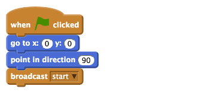
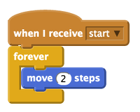
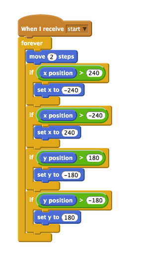
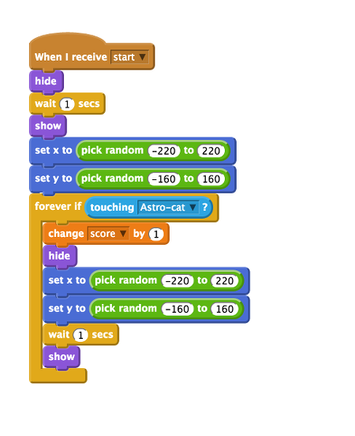

# Weightlessness: Mooncake in Space

In space, it feels like everything is floating. This is because everything becomes **weightless** outside of our planet, Earth. This is probably the biggest difference from being on Earth, where everything and everybody is pulled down towards the ground. On Earth, we can all feel this downward pull, but we're so used to it that we sometimes don't even think about it. This pull or attraction we feel is called **gravity**.

You can recreate the effects of weightlessness in space in this Scratch game, either by using [Scratch online](https://scratch.mit.edu/) from a Computer or by using Scratch on the Raspberry Pi.

## Set the stage with a space theme

1. If you are using a Raspberry Pi you can open Scratch by clicking on **Menu** and **Programming**, followed by **Scratch**. 

1. Create a new file by selecting **File** and **New**.

1. Delete the Scratch cat sprite by right-clicking on it and selecting **Delete** from the menu that is displayed.

1. For this project, you need to create a new background. To do this, click on `stage` in the sprites palette and then click on `Backgrounds` next to the `scripts` tab.

1. Click on `Paint` to draw your own background. Once you're happy with your stage design, click **OK**. 	

1. Next you will need to create a single sprite with two costumes, one shown flying and one falling. You can download an example sprite below which features Mooncake (the Raspberry Pi cat) wearing a jetpack.

     
     
1.  If you are connected to the internet you can download this sprite by clicking on the image above or using this [link](files/Astro-Cat.sprite). Save the sprite somewhere you can find it later.

1. Next, add a new sprite by clicking on the `import a new sprite` icon on the sprites palette (which looks like the image below), then select `Astro-Cat` from the choices and click **OK**.

	
	
1. Click on the `costumes` tab for the Mooncake sprite. You will see two Mooncake costumes: one with a jetpack firing and one without. You will use these costumes within your game to show that Mooncake is moving. 
	  	
1. Click on the `scripts` tab of the sprite, and then save your Scratch project work by clicking on **File** and **Save As**. Name your program **weightless** and save it in your home directory or another place that you can find it later.

## Setting the start position

1. Open the `Control` blocks area and begin by dragging a `When green flag clicked` block into the main script area.

1. To make sure that Mooncake starts at the top of the screen at the start of the program, you'll need to set the coordinates. Use a `go to x: 0  y: 0` block from the `Motion` blocks area. Drag it over and clip it beneath `When green flag clicked`.

1. Drag a `point in direction` motion block and connect it to your script.

1. Click on the **Control** blocks and add a `broadcast` block. Select **New** from the drop-down menu. Name the new broadcast message `start`.

	

	A broadcast block with a unique message is used to coordinate the actions of different sprites and the stage in Scratch.

## Adding movement

As Mooncake is in space, she would be experiencing the effects of weightlessness and float about. We've given her a jetpack so that she can change direction, thanks to a source of energy. Without a jetpack or anything to push against, Mooncake would just keep going in one direction!

1. With the Astro Cat sprite selected, click on the control blocks and add a `when I receive` block to the stage. Select **start** from the drop-down list. Remember that this is the message that is broadcast by your first script.

1. Next, add a `forever` looping block underneath. 

1. Add a `move 2 steps` block inside the `forever` loop. 

1. Save your work so far and click on the green flag to test your scripts work as expected. Mooncake should move in one direction until she reaches the edge of the stage.

	

## Adding directonal movement

Let's control the direction of Mooncake the Astro Cat with code. 

1. Add another `when green flag clicked` control block to the scripts area for your sprite. 

1. Connect a `forever` looping block.

1. Then add an `if else` control block inside the loop. 

	Conditional blocks like `if` and `if else` allow you to set a condition that, if met, triggers an event. For example, you'll set the condition here that if the left arrow key has been pressed, then the code will point the sprite left and switch the sprite costume so that it looks like her jetpack is firing. If the key is not pressed, it will use the first costume.

1. To set a condition in Scratch, you need to add some blocks into the space next to the word `if`. Drag a `key space pressed` sensing block and put it into the space. Using the drop-down menu, select `left arrow`.

1. Put a `point in direction` movement block inside the `if` part of the `if else` block. Set the direction to left or `-90` degrees. 

1. Underneath, add a `switch to costume` block and select your second sprite costume (the one with the flames coming out of the jetpack).
	
	

1. Save and test that your direction arrow works. You'll need to repeat this step for each direction that you want to move in, i.e. up, down, and right. What values would you need to change for each direction?	

## Wrapping space

Mooncake the Astro Cat's movement is programmed to be automatic. This means that when she hits the edge of the stage she stops. You can add some code to make the sprite reappear on the other side when she goes off screen, to give the appearance of endless space. This is called wrapping. 

1. Add a `When I receive` control block onto the scripts area for your Mooncake sprite. Select **start** from the drop-down list.

1. Next, connect a `forever` loop to the control block. Add a `Move 2 steps` motion block inside the `forever` loop. 

1. Underneath the `move` block, connect an `if` control block. This block has a space to add other blocks to set the condition. 

1. Click on the operators blocks and select the greater than block which has this symbol `>`. Drag the block and place it inside the `if` space. 

1. Add an `x position` movement block on the left side of the `>` symbol, then on the right side type `240`. 

1. Place a `set x to ` block inside the `if` block and type the value `-240`. 

	This sets the condition that if the position of the sprite on the x axis is 240, then the code moves the sprite to -240 on the same axis. So if the sprite goes off the right-hand side of the screen, then she will reappear on the left. You'll need to repeat the steps above for the left-hand side of the screen, but remember to switch the values so that the x position is greater than or equal to `-240`, and the `set x to ` block value is `240`. 

1. Now you'll need to add two more conditions for the top and bottom of the screen. Repeat the steps above, but this time use the values `180` and `-180` for the `y` axis. Check the image below against your code to check that your values are correct.

	

## Make a game of it with variables

A way to keep score during the game is required. You can use a variable in your code to do this. A variable is a fancy name for storing data for use later on.

1. To create a variable, click on `Variables` in the blocks palette and then click `Make a Variable`. The `New Variable` window opens and asks you to type a name for your variable.

1. Name the first variable `score` and ensure that `For all sprites` is checked before clicking **OK**.

1. You’ll see some orange blocks are added to your Variable area called `score`, and a small counter box will appear on the stage.

1. Create another variable called `Time` that you can use to time each game. 

1. Navigate back to your first script block that looks like this:

	

1. Add a `set score to 0` and a `set time to 0` variable block above the `broadcast` block, so that at the start of each game they will be reset to 0.

1. Add a `forever` loop underneath.

1. Place a `change time by 1` variable block inside the `forever` loop, followed by a `wait 1 secs` control block, so that each time round the loop the time will increase by 1. 

	

## Catch the randomly moving ISS

Mooncake needs something to chase in order for this program to become a game for people to play. This could be cat food, aliens or even a space mouse! We've used an image of the International Space Station for Mooncake to try and reach but you can use what you like. Simply follow the steps and replace the sprite with whatever you would like to use. 

1. If your Raspberry Pi is connected to the internet you can download [this ISS sprite](files/iss.png) using the link. Save the image somewhere that you'll be able to find it later on your computer or Raspberry Pi.

1. Next, add a new sprite by clicking on the `import a new sprite` icon on the sprites palette, then select `ISS.png` from the choices and click **OK**. Another sprite will be added to your sprites palette. 

1. Click on the ISS sprite to select it. A blank scripts area will appear. This is where you'll write the code that affects this sprite. 

1. Begin by placing a `When I receive` control block into the scripts area. Using the drop-down menu, select `start`. 

1. Connect a `hide` looks block underneath, followed by a `wait 1 secs` block and then a `show` looks block. 

1. To make the game interesting, let's use some code that makes the ISS randomly appear at different places across the screen. To do this, add a `set x to ` block to the script, then inside the space add a `pick random` block and change the values to `-220 to 220`. This will place the ISS sprite on the x axis on the screen anywhere between -220 and 220. Repeat this step for the y axis to `set y to pick random -160 to 160`. 

	This code will allow the ISS sprite to appear randomly once. Mooncake would easily be able to reach it and the game would be over. You can add some code so that each time Mooncake catches the ISS, it reappears randomly elsewhere. 

1. Underneath the last block, add a `forever if` conditional loop. Inside the space on the block drop in a `touching ?` sensing block. Using the drop-down arrow, select the Astro Cat sprite.   

1. Add a `change score by 1` variable block inside the `forever if` loop. Each time the player reaches the ISS sprite, the score will go up by 1 point. 

1. Then repeat the code you used to randomly place the ISS on the screen like this:

	
	
1. Save your work by clicking on **File** and **Save**.

## Creating a Game Over screen

First, you need to add a new Game Over background to the stage. You could paint or import a new one, but here we will duplicate the existing space background and edit it to display Game Over across it in large letters. 

1. Click on the **stage** icon and then click on **backgrounds**. Make a copy of the space background by clicking on **copy**. 

1. Now click on **Edit** to open the paint editor window. Using the text tool, type 'Game Over' in large letters on the background. You can choose a colour and font that you like. When you're happy with how it looks, click on **OK**.

	

1. Next, click on the **Scripts** tab and add a `when green flag clicked` control block to the scripts area. Note that the scripts area on the stage should be empty, as all your other scripts are on your sprites.

1. Add a `switch to background` look block underneath. Select **space background** from the drop-down box. This is the stage that you want the game to start with. 

1. Now add a `forever if` block to the script. Place an `equals` operator block inside the hexagon section of the `forever if` block. Click on the variables blocks, drag the `time` variable block across and add it to the left-hand side of `=`. Type `30` into the right-hand side of `=`.

1. Then place a `switch to background` block inside the `forever if` block. Select **space background1** from the drop-down list. This should be your Game Over screen. 

1. Finally, add a `stop all` control block underneath the last block. The `stop all` control block will stop all the scripts in Scratch from running, ending the game.

	

1. Add the control block `broadcast` and create a new broadcast message called Game Over.

1. Save your game and test that it works by clicking on the green start flag. 

		
	
## What's next?	

- You could make the game more interesting by adding extra sprites for Mooncake to reach. Perhaps some of them could give her a speed boost or slow her down. Adding obstacles could also be a fun way to add more excitement to your game. 

- Check out some of our other [space-themed projects](https://astro-pi.org/resources/). 
